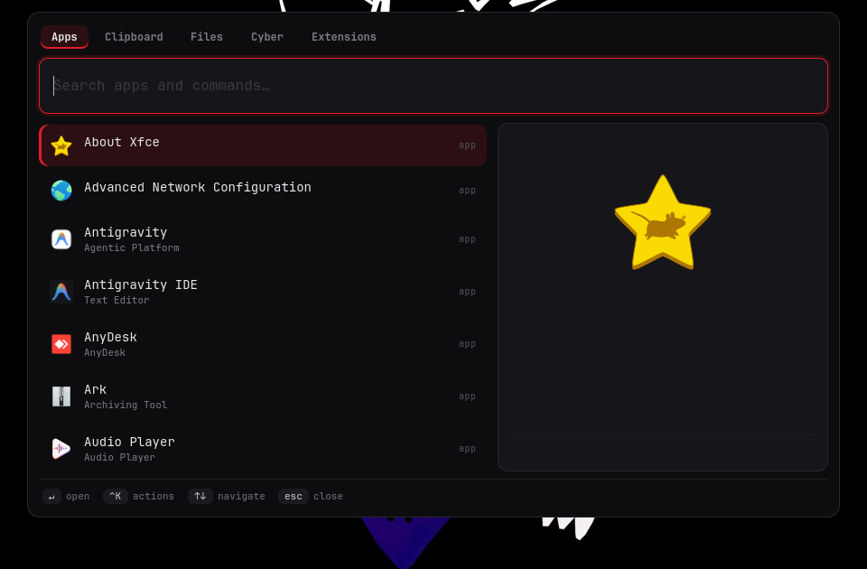
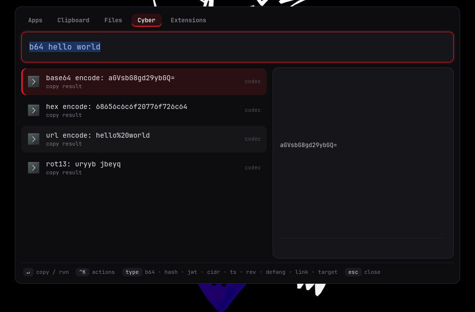
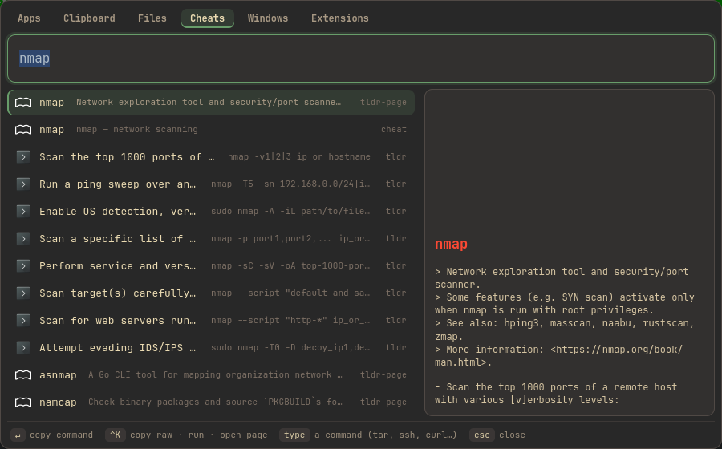
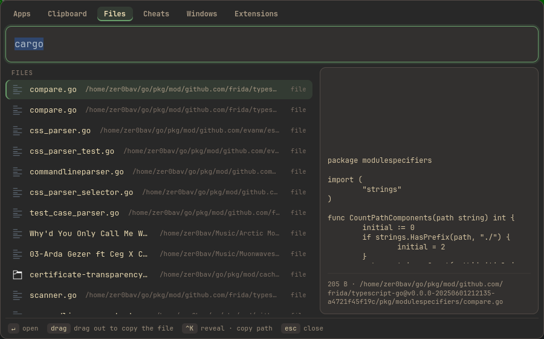
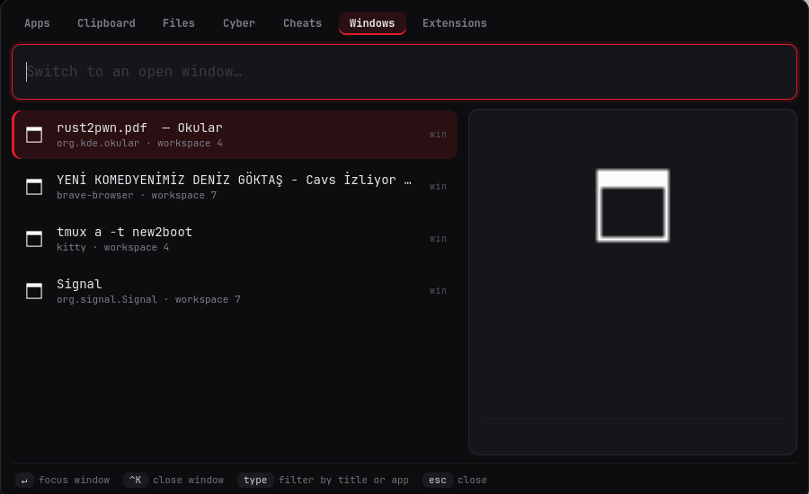
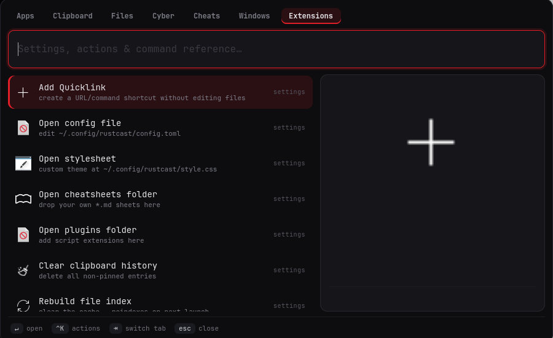

# rustcast 🦀🚀

A **Raycast-class application launcher for Linux**, written in Rust — fast, native,
keyboard-driven, with a built-in **cybersecurity toolkit**.

> Linux deserves a launcher as good as Raycast: instant, extensible, hacker-red —
> and useful whether you're red team, blue team, or just launching apps.



## Highlights

- ⚡ **Instant** — runs as a resident daemon; the hotkey toggles the window in
  tens of milliseconds instead of cold-starting GTK each time. The app index is
  disk-cached and refreshed in the background
- 🔎 **App launcher** — fuzzy search over your `.desktop` apps, with icons, and
  **frecency** ranking that floats your most-used items to the top
- 📖 **tldr search** — the Cheats tab searches the official
  [tldr-pages](https://github.com/tldr-pages/tldr) (10k+ community command
  examples). Each example is its own row: Enter copies just that command
  (placeholders stripped). Downloaded once (~5 MB), then fully offline
- 🏷️ **Aliases** — `ff` → Firefox, `mail` → Gmail; short triggers you define
- 🌐 **Web fallback** — a query with no local match offers "Search Google / DuckDuckGo"
- 📌 **Pin favorites** — Ctrl+K → "Pin to top" sticks your most-used apps,
  quicklinks or commands to the top of the root (persisted across restarts)
- ⚙️ **In-app settings** — toggle animations / clipboard from the Extensions tab;
  add quicklinks from the UI — all written back to the config, comments preserved
- 🎛️ **Command palette** — the root list mixes your apps with commands like
  "Kill Process", "Window Switcher", "Generate Secret"; press Enter to drop into
  an **isolated mode** where typing just filters (Esc backs out). No magic
  prefixes, so a command never collides with an app of the same name
- 📋 **Native clipboard history** — text **and** images, live previews, pin/delete,
  dedup. Its own background watcher (no `cliphist`, no prefixes)
- 🔎 **File search** — fuzzy find with live preview and **drag-and-drop** out to
  other apps (plus copy-path fallback)
- 🛡️ **Cyber toolkit** — base64/hex/url/rot13 codecs, md5/sha1/sha256/sha512,
  JWT decode, CIDR calculator, epoch↔time, defang/refang, reverse-shell generator,
  and OSINT link-outs (VirusTotal/Shodan/NVD…) — all live as you type
- 💀 **Kill Process** — lists processes with owner + memory; Enter sends SIGTERM,
  Ctrl+K force-kills; stays open so you can kill several in a row
- 🔌 **Port Inspector** — shows what's listening on a port and kills it
- 🪟 **Window Switcher** — its own tab (or `Super+Alt+W`); Enter focuses a window
- 🔐 **Generate Secret** — strong passwords, hex/base64 tokens, UUIDs, PINs
- 📚 **Cheatsheets** — bundled Markdown references (nmap, tmux, vim, curl, gdb,
  hashcat, sqlmap, linux-privesc…) plus your own `~/.config/rustcast/cheatsheets/*.md`,
  searchable alongside tldr on the Cheats tab
- 🔗 **Quicklinks** — `{query}` URL/command templates, addable from the UI
  ("Add Quicklink"), no config editing required
- 🧩 **Extensions** — script plugins in any language (JSON over stdout)
- 🧮 **Calculator + converter** — works with **no external tools** (built-in
  evaluator); also unit and currency conversion (`10 km in mi`, `100 f to c`,
  `10 usd in eur`). Uses `qalc` when installed
- ✂️ **Snippets** with `{date}` / `{time}` / `{clipboard}` tokens, 🖥️ **system +
  window-management commands**
- 🔤 **Clipboard image OCR** — Ctrl+K → "Extract text (OCR)" on an image (tesseract)
- 🩺 **Dependency check** — the Extensions/settings tab shows which optional tools
  are present or missing, with install hints
- ⌨️ **Mode tabs** (Apps · Clipboard · Files · Cyber · Cheats · Windows · Extensions)
  and a Cmd-K style actions menu
- 🔴⚫ Softened red/black theme, English UI, GTK4

### More screenshots

| Cyber toolkit | Cheatsheets (Markdown) |
|---|---|
|  |  |
| **File search + drag-out** | **Window switcher** |
|  |  |
| **Extensions & settings** | |
|  | |

## Works everywhere

- **Hyprland / Sway / river / wayfire** — renders as a `wlr-layer-shell` overlay.
- **GNOME / KDE / any Wayland or X11 desktop** — automatically falls back to a
  normal borderless window that closes on focus loss.
- Clipboard/paste uses `wl-clipboard` on Wayland and `xclip`/`xsel` on X11.
  Clipboard **history** needs a Wayland session (`wl-paste`).

## Install

### From crates.io

```bash
cargo install rustcast-linux    # installs the `rustcast` binary
```

Needs GTK 4 (and `gtk4-layer-shell` for the wlroots overlay) installed. This
gives you just the binary — bind it to a hotkey (see below); for the desktop
entry and daemons, use `install.sh` or the packages below.

### From source (with desktop entry + daemons)

```bash
git clone https://github.com/zer0bav/rustcast
cd rustcast
./install.sh
```

`install.sh` builds the release binary, installs it to `~/.local/bin`, adds a
desktop entry and default config, and (on systemd) enables the resident launcher
daemon plus, on Wayland, the clipboard history daemon. It prints the exact
keybinding snippet for your desktop.

### Arch Linux

A ready-to-build `rustcast-git` package lives in `packaging/aur/` — no AUR
account needed, install it straight from this repo:

```bash
git clone https://github.com/zer0bav/rustcast
cd rustcast/packaging/aur
makepkg -si            # builds a pacman package (from the latest git) and installs it
```

This gives you a proper `pacman`-tracked package (`pacman -R rustcast-git` to
remove) with the systemd user services and desktop entry installed system-wide.
An AUR upload is planned once registration reopens.

Build dependencies: `cargo`, `gtk4` (dev), and — for the overlay mode on
wlroots — `gtk4-layer-shell` (dev).

```
Arch:          sudo pacman -S gtk4 gtk4-layer-shell
Debian/Ubuntu: sudo apt install libgtk-4-dev libgtk4-layer-shell-dev
Fedora:        sudo dnf install gtk4-devel gtk4-layer-shell-devel
```

## Bind a hotkey

rustcast doesn't grab a global hotkey itself (that's the compositor's job). It
runs as a resident daemon, so the same command **toggles** the window — press to
show, press again to hide:

```ini
# Hyprland (~/.config/hypr/…)
bind = SUPER, SPACE, exec, rustcast
bind = SUPER, V,     exec, rustcast --tab clipboard
```
```ini
# Sway (~/.config/sway/config)
bindsym $mod+space exec rustcast
bindsym $mod+v     exec rustcast --tab clipboard
```
- **GNOME:** Settings → Keyboard → Custom Shortcuts → command `rustcast`
- **KDE:** System Settings → Shortcuts → Custom → command `rustcast`

`rustcast --daemon` starts it resident and hidden (the systemd user service does
this at login); `rustcast --quit` stops it. If the overlay ever misbehaves on
your compositor, bind `rustcast --no-daemon` for the classic one-shot mode.

## Usage

- Type to search; `↑`/`↓` (or `Ctrl+J/K`) to move; `Enter` to run.
- `Tab` / `Shift+Tab` cycle tabs; `Ctrl+1..7` jump to one.
- `Ctrl+K` opens the actions menu (copy, delete, pin, reveal, force-kill, …).
- `Esc` clears the query, then closes.

**Cyber tab** — type a keyword or just paste: `b64 hello`, `hash secret`, a JWT,
`cidr 10.0.0.0/24`, `ts 1516239022`, `rev 10.0.0.5:4444`, `defang http://1.2.3.4`,
`link CVE-2021-44228`, `target 10.0.0.5`.

**Command modes** — find a command in the root list ("Kill Process", "Window
Switcher", "Port Inspector", "Generate Secret", "Search Cheatsheets") and press
Enter to drop into an isolated view where typing just filters within it (Esc
backs out). Because you *enter* the mode rather than type a magic prefix, a
command never collides with an app of the same name. The **Windows** tab (or
`Super+Alt+W`) opens the window switcher directly.

The cyber toolkit still uses inline prefixes (`= 2+2`, `b64 hello`, `hash …`,
`jwt …`, `cidr …`, `rev host:port`, `link CVE-…`).

**Cheats tab** — search the tldr-pages (the first use downloads the ~5 MB archive;
Enter the "Download tldr pages" row). Type a command like `tar extract` or
`ssh tunnel`: each example is its own row — Enter copies just that command with
`{{placeholders}}` stripped, Ctrl+K offers "copy with placeholders", "run in
terminal", and "open page". Bundled cheatsheets and your own Markdown in
`~/.config/rustcast/cheatsheets/` are searchable here too.

## Configuration

Config lives at `~/.config/rustcast/config.toml` (see `config.example.toml`):
UI size, terminal, clipboard cap, file roots, **quicklinks**, **snippets**, and
**aliases**. Edits apply on the next window show — no restart needed. Drop a
custom theme at `~/.config/rustcast/style.css`.

## Extensions

Create `~/.config/rustcast/plugins/<name>/manifest.toml`
(`name`, `prefix`, `icon`, `exec`). The executable gets the query as `$1` and
prints:

```json
{ "items": [
  { "title": "…", "subtitle": "…", "icon": "…",
    "action": { "kind": "copy|open|shell|launch", "data": "…" } }
] }
```

See `plugins/example-echo/` for a working sample.

## Architecture

A Cargo workspace: **`rustcast-core`** (pure logic, no GTK — providers, ranking,
config, and the cyber toolkit, all unit-tested headlessly) and **`rustcast-gui`**
(the GTK4 binary). Providers implement a common trait and plug into tabs and
inline prefixes via a registry.

```bash
cargo test -p rustcast-core   # headless unit tests
cargo build --release
```

## License

[MIT](LICENSE) © 2026 zer0bav
